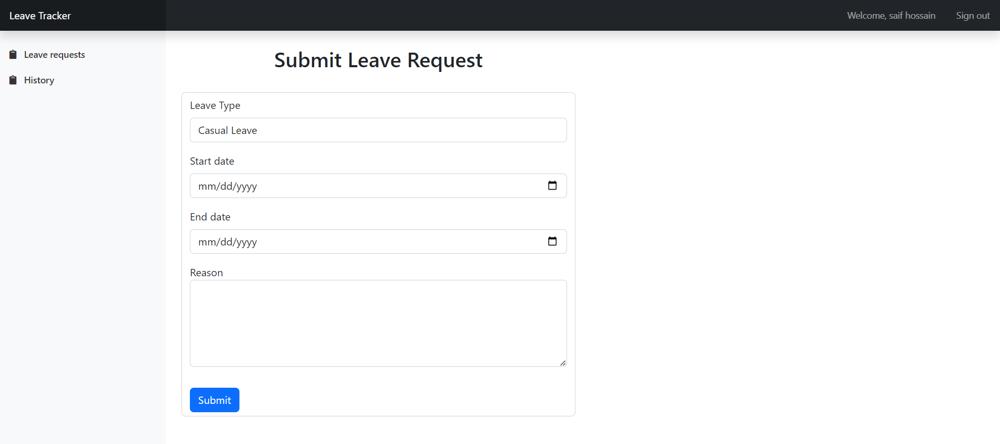
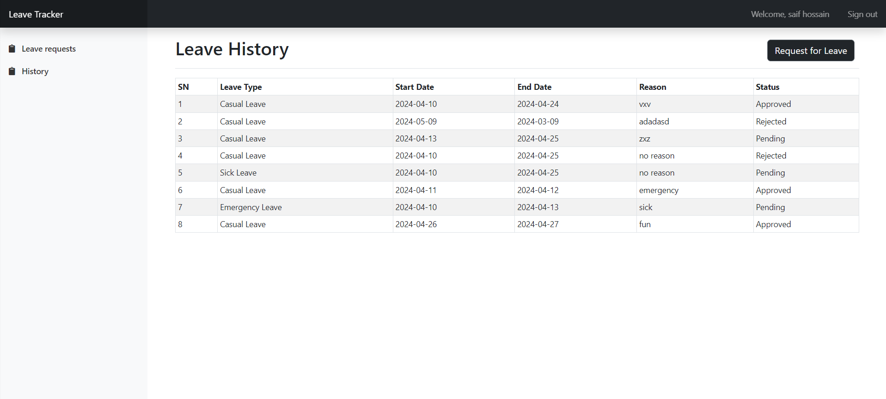

<!-- PROJECT LOGO -->
<br />
<div align="center">
  <a href="">
    
  </a>

<h2 align="center"> Leave Tracker</h2>

  <p align="center"> Leave Tracker is a simple web application developed using the Laravel framework for tracking
 employee leaves. The application allows employees to log in, submit leave requests, view their
 leave history, and for administrators to manage leave requests. </p>


[//]: # (<a href="/">View Demo</a>)
</div>


<!-- TABLE OF CONTENTS -->
<details>
  <summary>Table of Contents</summary>
  <ol>
    <li>
      <a href="#About-The-Project">About The Project</a>
    </li>
    <li>
      <a href="#getting-started">Getting Started</a>
    </li>
    <li><a href="#Project-Requirement-and-Roadmap">Product Requirement and Roadmap
</a></li>
    <li><a href="#Key-Features">Key Features</a></li>
    <li><a href="#contact">Contact</a></li>

  </ol>
</details>


<!-- ABOUT THE PROJECT -->

## About The Project




<p align="right">(<a href="#readme-top">back to top</a>)</p>

### Built With

* [![Laravel][Laravel.com]][Laravel-url]
* [![Bootstrap][Bootstrap.com]][Bootstrap-url]


<p align="right">(<a href="#readme-top">back to top</a>)</p>

<!-- GETTING STARTED -->

## Getting Started

### Prerequisites

* PHP 8.2.4+
* Composer (dependency manager for PHP)
* Database (MySQL/ PostgreSQL/ SQLite/ SQL Server)
* Git

### Installation

Please Follow the steps to install this project Locally.

#### 1. Clone the repo

Open your terminal and navigate to the directory where you want to install the Laravel project.
Then run the following command:

   ```sh
   git clone https://github.com/Sabbir-Hossain12/Leave-Tracker.git
   ```

#### 2. Navigate to Project Directory

Move into the project directory:

   ```sh
   cd Leave-Tracker
   ```

#### 3. Install Dependencies

Once you are in the project directory, use Composer to install the required dependencies:

   ```sh
   composer install
   ```

#### 4. Create Environment File

Laravel requires an environment file for configuration. Duplicate the .env.example file and save it as .env:

   ```sh
   cp .env.example .env
   ```

#### 5. Generate Application Key

Run the following command to generate a unique application key:

   ```sh
php artisan key:generate
   ```

#### 6. Run Migrations

Use the following command to run database migrations:

   ```sh
  php artisan migrate
   ```   

#### 7. Serve the Application

You can use Laravel's built-in development server to run the application locally.
Execute the following command:

```sh
php artisan serve
```   

This will start a development server, and you can access your Laravel application at http://127.0.0.1:8000 in your web
browser.
<p align="right">(<a href="#readme-top">back to top</a>)</p>


<!-- ROADMAP -->

## Project Requirement and Roadmap

* Use Laravel framework for backend development.
* Implement CRUD operations for managing user accounts and leave requests.
* Utilize Laravel's authentication system for user login and registration.
* UseLaravel's email functionality for sending notifications.
* Implement form validation to ensure the correctness of user input.
* UseBladetemplates for frontend views.
* Implementation of Vue/React for frontend will be a plus

## Pages:
### Login/Register Page:
Allows users to log in or register for a new account.
### Dashboard (for Admins):
Displays statistics and pending leave requests. Provides links to manage user accounts
and leave requests.
### LeaveRequest Form:
Allows employees to submit leave requests.
### LeaveHistory Page:
Shows a list of past leave requests for the logged-in user

## Key Features:
### User Authentication:
Employees should be able to register an account or log in if they already have one.
Admins should have special privileges to manage user accounts and leave requests.
Admins will be able to approve employee registrations or block existing ones.
###  Leave Request Submission:
Employees should be able to submit leave requests specifying the type of leave (Casual
Leave, Sick Leave, Emergency Leave), the start date, end date, and reason for leave.
### Leave Approval Workflow:
Admins should be able to review pending leave requests and approve or reject them.
If a leave request is approved or rejected, the employee should receive a notification via
email.
###  Leave History:
Employees should be able to view their leave history, including past leave requests, their
statuses, and any comments added by the admin.
### Dashboard:
Admins should have access to a dashboard displaying statistics such as the total
number of leave requests, pending requests, approved requests, and rejected requests.
### Email Notifications:
Automated email notifications should be sent to employees upon submission, approval,
or rejection of their leave requests

<p align="right">(<a href="#readme-top">back to top</a>)</p>


<!-- CONTACT -->

## Contact

Sabbir Hossain- h.sabbir36@yahoo.com

Project Link: https://github.com/Sabbir-Hossain12/Leave-Tracker

<p align="right">(<a href="#readme-top">back to top</a>)</p>


<!-- MARKDOWN LINKS & IMAGES -->
<!-- https://www.markdownguide.org/basic-syntax/#reference-style-links -->

[contributors-shield]: https://img.shields.io/github/contributors/othneildrew/Best-README-Template.svg?style=for-the-badge

[contributors-url]: https://github.com/othneildrew/Best-README-Template/graphs/contributors

[forks-shield]: https://img.shields.io/github/forks/othneildrew/Best-README-Template.svg?style=for-the-badge

[forks-url]: https://github.com/othneildrew/Best-README-Template/network/members

[stars-shield]: https://img.shields.io/github/stars/othneildrew/Best-README-Template.svg?style=for-the-badge

[stars-url]: https://github.com/othneildrew/Best-README-Template/stargazers

[issues-shield]: https://img.shields.io/github/issues/othneildrew/Best-README-Template.svg?style=for-the-badge

[issues-url]: https://github.com/othneildrew/Best-README-Template/issues

[license-shield]: https://img.shields.io/github/license/othneildrew/Best-README-Template.svg?style=for-the-badge

[license-url]: https://github.com/othneildrew/Best-README-Template/blob/master/LICENSE.txt

[linkedin-shield]: https://img.shields.io/badge/-LinkedIn-black.svg?style=for-the-badge&logo=linkedin&colorB=555

[linkedin-url]: https://linkedin.com/in/othneildrew

[product-screenshot]: images/screenshot.png

[Next.js]: https://img.shields.io/badge/next.js-000000?style=for-the-badge&logo=nextdotjs&logoColor=white

[Next-url]: https://nextjs.org/

[React.js]: https://img.shields.io/badge/React-20232A?style=for-the-badge&logo=react&logoColor=61DAFB

[React-url]: https://reactjs.org/

[Vue.js]: https://img.shields.io/badge/Vue.js-35495E?style=for-the-badge&logo=vuedotjs&logoColor=4FC08D

[Vue-url]: https://vuejs.org/

[Angular.io]: https://img.shields.io/badge/Angular-DD0031?style=for-the-badge&logo=angular&logoColor=white

[Angular-url]: https://angular.io/

[Svelte.dev]: https://img.shields.io/badge/Svelte-4A4A55?style=for-the-badge&logo=svelte&logoColor=FF3E00

[Svelte-url]: https://svelte.dev/

[Laravel.com]: https://img.shields.io/badge/Laravel-FF2D20?style=for-the-badge&logo=laravel&logoColor=white

[Laravel-url]: https://laravel.com

[Bootstrap.com]: https://img.shields.io/badge/Bootstrap-563D7C?style=for-the-badge&logo=bootstrap&logoColor=white

[Bootstrap-url]: https://getbootstrap.com

[JQuery.com]: https://img.shields.io/badge/jQuery-0769AD?style=for-the-badge&logo=jquery&logoColor=white

[JQuery-url]: https://jquery.com 
